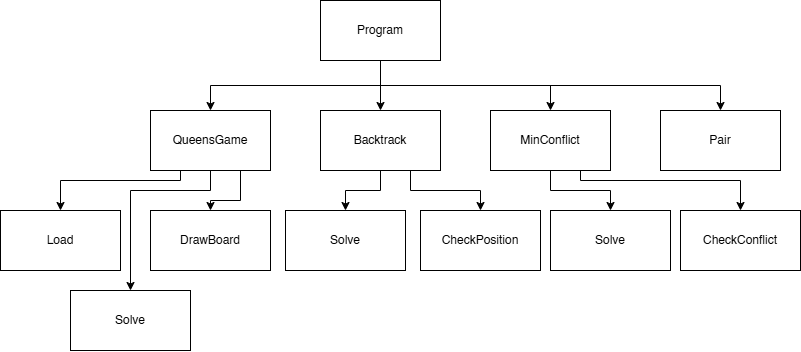
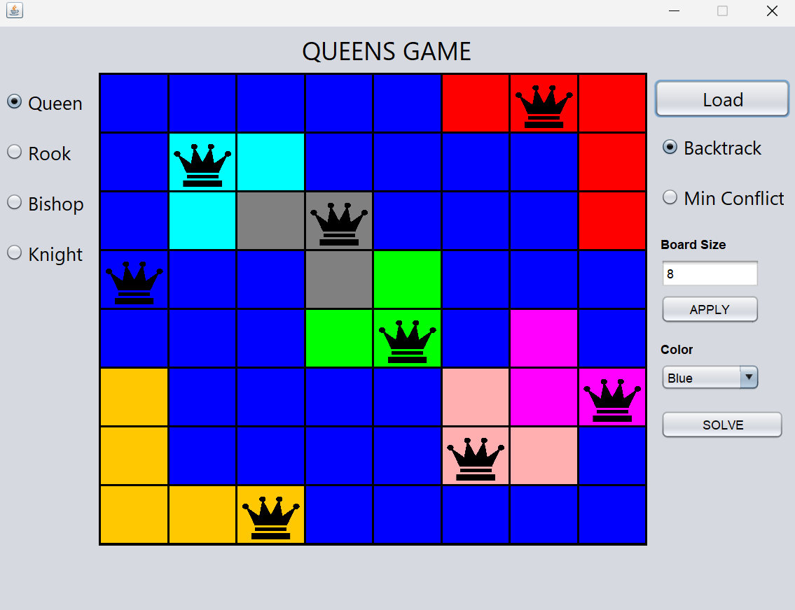

# QUEENS GAME SOLVER
## Description
GUI Solver for the LinkedIn game "Queens". You can load the board from a txt file or edit directly from the GUI. 
To change the size of the board (max of 10), type into the "Board Size" entry and click "Apply". To change the color of the board, pick the color you want to add
from the "Color" dropdown, then click the individual squares you want to change. 
You can choose between 4 pieces: Queen, Rook, Bishop, or Knight. You can choose which Algorithm you want to use between Backtrack or MinConflict. 
Click the "Solve" button to display solution.

## Technologies Used
* Java
* Maven

## Program Structure


## Executing program
1. Run the jar file from main directory
```
java -jar target/QueensGame-1.0-SNAPSHOT.jar
```

# Algorithms Used
The program uses 2 algorithms for finding solutions: **Backtrack** and **MinConflict**. The user can choose which Algorithm to choose by clicking the corresponding button in the GUI. Backtrack Algorithm is an improvement of Exhaustive Search Algorithm, where the algorithm _backtracks_ when it meets a combination that doesn't fit the constraint. The algorithm will try to place a piece in a column from the first row, then try to place it in a column from the second row and so on. If the placement doesn't fit the constraint, the program will backtrack and try to place the piece in the next column. The algorithm will continue to do so until it finds a solution or if it has tried to place the piece in all columns. The constraint is based on the piece the user chooses. MinConflict is a heuristic algorithm which tries to find a combination with the least conflict (least pieces conflicting each other). The algorithm will place the first piece in a random position, then finds another random position where the next piece least conflicts with the first piece and place the next piece there until all pieces are placed. If there are still conflicts between pieces, the algorithm will choose a random piece and checks for positions with the least conflict. If there are multiple positions with minimal conflicts, the algorithm will choose a random one to move the pieces at. The algorithm will repeat until a solution is found or the predetermined max iteration is reached. 
<br>
The backtrack algorithm is used because it guarantees a correct output, whether there's a solution or no solution. It is also faster than brute force because it doesn't need to check for all possible combinations. MinConflict is used to give an image on the application of heuristic in the Queens Game, as well as a comparison to Backtrack. However, it may not guarantee a correct output as it may get stuck in local optimums. 

## Screenshots
* Main Display


## Authors
Ariel Herfrison

## Acknowledgments
* [Queens-Game](https://www.linkedin.com/games/queens/)
* [Backtrack-Algorithm](https://informatika.stei.itb.ac.id/~rinaldi.munir/Stmik/2020-2021/Algoritma-backtracking-2021-Bagian1.pdf)
* [Min-Conflict-Algorithm](https://en.wikipedia.org/wiki/Min-conflicts_algorithm)
